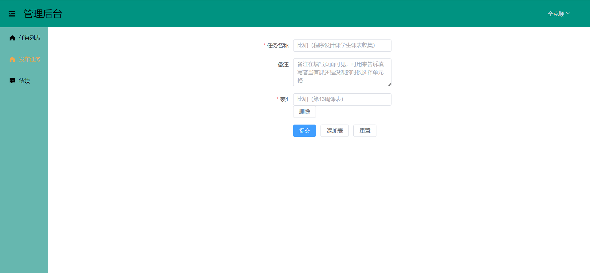

这是一个收集课表，统计公共空暇时间的项目
项目功能虽小但五脏六腑居在
技术栈：
- 前端：（前端打包命令：vite build）
1. vue3.0(组合式API)
2. vite
3. axios
4. vue-router
5. pinia
- 后端：
1. SpringBoot2.7 + springmvc
2. SpringSecurity
3. mysql + redis
4. mybatis-plus
5. jackson
6. swagger

效果图：
1. 填写页面，填写人无需注册登录，只需在右上角填写唯一Id和用户名即可，这些信息保存在本地，可以随时修改

2. 登录注册页面

3. 创建的任务列表

4. 发布新任务页面(一个任务可以要求填写人填写多张课表)

5. 分享链接

6. 查看最终结果并查看每个单元格选择的人的名字列表

<a href="http://ashun.top/">作者的博客网站</a>
